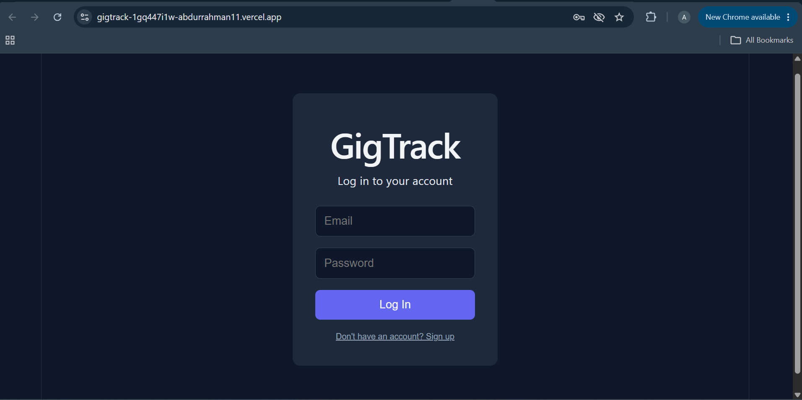
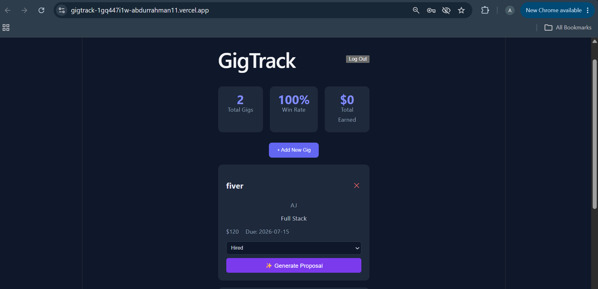
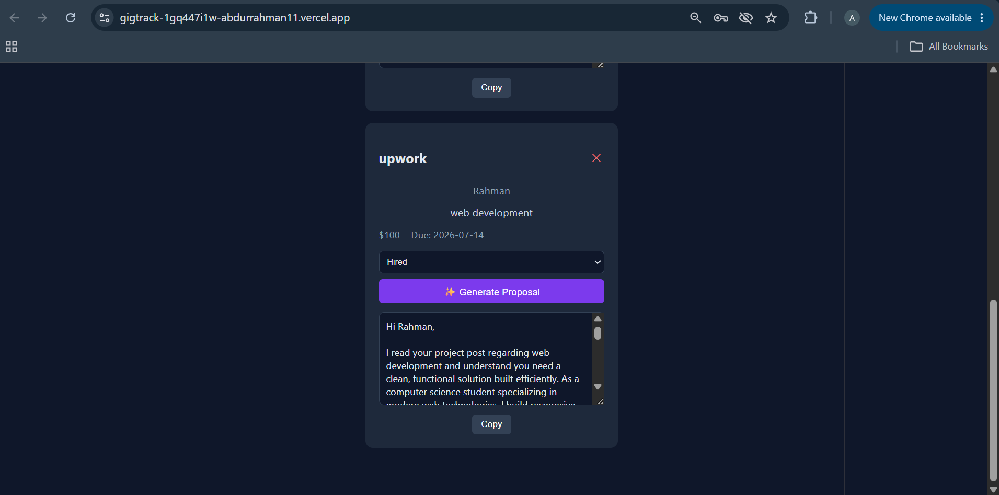

# GigTrack

**GigTrack** is a freelance gig pipeline tracker that helps freelancers manage job applications from first contact to final payment — and uses AI to help them write better proposals faster.

## The Problem

As a computer science student building freelancing income on platforms like Upwork and Fiverr, I found myself losing track of which jobs I'd applied to, forgetting to follow up, and spending too long writing a new cover letter for every single application. GigTrack solves this for freelancers (including myself) who need a simple, centralized way to track applications and speed up the most repetitive part of freelancing: writing proposals.

## Live Demo

🔗 **[https://gigtrack-1gq447i1w-abdurrahman11.vercel.app/](https://gigtrack-1gq447i1w-abdurrahman11.vercel.app/)**


## Features

- **User authentication** — secure sign up and log in (Supabase Auth)
- **Gig pipeline tracking** — add gigs with platform, client, description, budget, and deadline
- **Status management** — move gigs through Applied → Interviewing → Hired → Completed → Paid
- **Dashboard** — live stats on total gigs, win rate, and total earnings
- **AI Proposal Generator** — generate a tailored cover letter for any gig with one click, editable and copyable
- **Delete gigs** — remove entries no longer needed
- **Data persistence** — all data stored securely per-user in a Postgres database (Supabase), protected by Row Level Security

## The AI Feature

**What it does:** Given a gig's job description, platform, and client name, the AI generates a concise, non-generic cover letter proposal (120-180 words) that references specifics of the job post rather than using a generic template.

**System prompt used:**
> You are a proposal-writing assistant for a freelance web developer who is a computer science student building a portfolio in HTML/CSS, JavaScript, React, and SQL. Given a job posting, write a concise, confident, non-generic cover letter, 120 to 180 words, that opens by referencing something specific from the job post, highlights one or two directly relevant skills backed by a concrete example project, avoids cliches like being a hard worker or the perfect fit, and ends with one clear, low-friction next step. Do not invent experience the user has not provided. Write only the proposal text, no preamble or explanation.

The generated proposal is fully editable in the UI before copying, so the user can personalize it further.

## Tools, Services, and AI Models Used

- **Frontend:** React + Vite
- **Backend / Database / Auth:** Supabase (PostgreSQL, Row Level Security, Auth)
- **AI Model:** Google Gemini API (`gemini-3.5-flash-lite`)
- **Deployment:** Vercel (frontend + serverless API function)
- **Development assistance:** Claude (Anthropic) — used throughout for debugging, code generation, and guidance while building this project
- **Version control:** Git + GitHub

## Screenshots

### Login Page


### Dashboard


### AI Proposal Generator


## How to Run This Project Locally

### Prerequisites
- Node.js (v18 or higher)
- A Supabase account and project
- A Google Gemini API key (free at [aistudio.google.com](https://aistudio.google.com))

### Setup

1. Clone the repository:
```bash
git clone https://github.com/abdurrahman130/gigtrack.git
cd gigtrack
```

2. Install dependencies:
```bash
npm install
```

3. Create a `.env` file in the project root with:

```env
VITE_SUPABASE_URL=your_supabase_project_url
VITE_SUPABASE_ANON_KEY=your_supabase_publishable_key
GEMINI_API_KEY=your_gemini_api_key_here
```

Replace the placeholder values with your own credentials. Do not commit the `.env` file to GitHub.
4. Set up the database — run this SQL in your Supabase SQL Editor:
```sql
create table gigs (
  id uuid default gen_random_uuid() primary key,
  user_id uuid references auth.users not null,
  platform text,
  client text,
  description text,
  budget numeric,
  status text default 'Applied',
  deadline date,
  created_at timestamp default now()
);

alter table gigs enable row level security;

create policy "Users manage own gigs" on gigs
  for all using (auth.uid() = user_id);
```

5. Run the development server:
```bash
npm run dev
```

6. For the AI feature to work locally, deploy to Vercel (or use `vercel dev`) with the following environment variable configured:

```env
GEMINI_API_KEY=your_gemini_api_key_here
```
## Author

Abdur Rahman — BS Computer Science, UET Peshawar